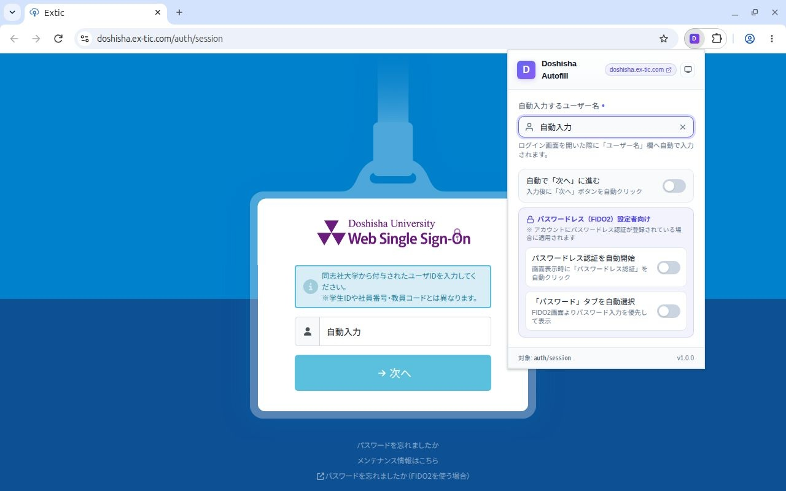
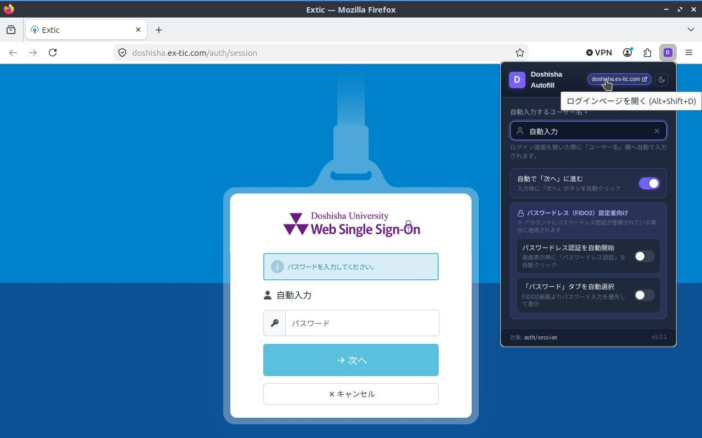

# Doshisha Autofill 拡張機能

同志社大学の認証システム（`https://doshisha.ex-tic.com/auth/*`、セッション画面: `https://doshisha.ex-tic.com/auth/session` 等）において、ユーザー名の自動入力から「次へ」の自動遷移、パスワードレス認証の自動開始までを一括で行うブラウザ拡張機能です。

| Chrome | Firefox |
| :---: | :---: |
|  |  |
| [👉 Chrome ウェブストアからインストール](https://chromewebstore.google.com/detail/pgjkkcomkkleghjjdkdcfeklbhfpanch) | 準備中（審査中） |

---

## 🌟 特徴

- **Manifest V3 準拠**: 最新の Chrome / Firefox / Edge などの拡張機能仕様に対応。
- **完全自動入力**: ログインページを開くだけで、登録されたユーザー名を即座に自動入力。
- **「次へ」ボタン自動クリック（ON/OFF切替可能）**: ユーザー名入力後、自動で「次へ」ボタンを押してパスワード画面へ進むオプションを搭載。
- **パスワードレス認証の自動開始（ON/OFF切替可能）**: 「次へ」押下後にパスワードレス（FIDO2）認証画面が表示された場合、自動で「パスワードレス認証」ボタンをクリックしてパスキー認証（Windows Hello等）を自動起動。
- **「パスワード」タブの自動選択（ON/OFF切替可能）**: FIDO2が利用可能な環境でも、パスワード入力を優先したい場合に「パスワード」タブを自動で選択して表示。
- **パスワード入力欄への自動フォーカス（標準搭載）**: パスワード画面表示時に自動で入力欄（`#password`）にフォーカスを当て、キーボードから手を離さずに即座に入力開始可能。
- **ショートカット起動（`Alt+Shift+D`）**: ブラウザ内のどこからでも、ショートカットキー一発で同志社ログイン画面を開けます（Mac: `Option+Shift+D`）。
- **動的レンダリング・SPA・jQuery対応**: Extic独自のjQuery `.data()` 画面遷移に対応した確実なStep判定と `MutationObserver` 監視により、遅延表示される入力欄や画面切り替えにも確実・安全に対応。
- **外観テーマ切替（システム連動／ライト／ダーク）**: OSのカラーテーマ設定に自動連動する「システム設定」のほか、「ライト」「ダーク」をヘッダー右上のテーマメニューからいつでも自由に切り替え・復帰可能。
- **安全なローカル/同期ストレージ**: ユーザー名と設定値はブラウザの `browser.storage.sync`（または `local`）にのみ安全に保存され、外部サーバーへ送信されることは一切ありません。

---

## 📦 インストール方法

### 1. 公式ストアからインストール（推奨）

- **Google Chrome / Microsoft Edge / Brave 等（Chromium系ブラウザ）**  
  👉 **[Chrome ウェブストアからインストール](https://chromewebstore.google.com/detail/pgjkkcomkkleghjjdkdcfeklbhfpanch)**  
  *※ Edge や Brave などの Chromium 系ブラウザでも、上記リンクからそのまま追加してご利用いただけます。*

- **Mozilla Firefox**  
  現在 **Firefox Browser ADD-ONS** にて公開審査中です。審査通過後にリンクを掲載いたします。

---

### 2. ソースコードから読み込む場合（開発・カスタマイズ時）

機能開発やカスタマイズを行う場合は、以下のデベロッパーモードを用いた読み込み手順をご利用ください。

#### Google Chrome / Microsoft Edge / Brave 等（Chromium系）
1. 本リポジトリをクローンするか、ZIPファイルをダウンロードして展開します。
2. ブラウザで拡張機能管理画面を開きます。
   - Chrome: `chrome://extensions/`
   - Edge: `edge://extensions/`
3. 画面右上にある「**デベロッパー モード**」を有効にします。
4. 左上に表示される「**パッケージ化されていない拡張機能を読み込む**」ボタンをクリックします。
5. リポジトリ内の **`src` ディレクトリ**（※リポジトリのルートではなく、必ず `src` フォルダ）を選択して読み込みます。

#### Mozilla Firefox
1. Firefox のアドレスバーに `about:debugging#/runtime/this-firefox` と入力して開きます。
2. 「**一時的なアドオンを読み込む...**」ボタンをクリックします。
3. リポジトリ内の **`src/manifest.json`** ファイルを選択します。  
   *※ 一時的なアドオンとして読み込まれるため、Firefox再起動時には再読み込みが必要になります。*

---

## 💡 使い方

1. 拡張機能アイコン（紫色の「D」アイコン）をクリックしてポップアップを開きます。
2. **「自動入力するユーザー名」** 欄に、ログインで使用するユーザー名を入力します。
3. お好みに応じて各種オプションのスイッチを設定します：
   - **「自動で「次へ」に進む」**: ユーザー名入力後、自動的に「次へ」ボタンを押します。
   - **「パスワードレス（FIDO2）設定者向け」グループ**（FIDO2認証が登録されているアカウント用）:
     - **「パスワードレス認証を自動開始」**: パスワードレス画面が表示された場合、自動的に「パスワードレス認証」ボタンを押してWindows Helloやセキュリティキーを起動します。
     - **「「パスワード」タブを自動選択」**: パスワードレス画面ではなく、パスワード入力タブを優先して自動選択します（FIDO2自動開始と排他で安全に制御）。
   ※ パスワード画面が表示された際は、設定不要で常に自動的にパスワード入力欄へフォーカスが当たります。
4. 入力内容や各種オプションはすべて**自動保存**されます（入力停止時やフォーカス解除時、スイッチ切替時に即時保存され、緑色のチェックアイコンで保存をお知らせします）。
5. `https://doshisha.ex-tic.com/auth/session` にアクセスすると、設定に応じて全自動でログイン認証フローが進みます。
   ※ すでにログイン画面を開いていた場合は、ページを再読み込み（F5またはリロード）することで新しい設定が反映されます。
6. **ショートカットキー `Alt+Shift+D`**（Mac: `Option+Shift+D`）を押すか、ポップアップ右上のバッジをクリックすれば、どこからでも即座にログイン画面を開けます。

---

## 📂 ファイル構成

```
.
├── .github/
│   └── workflows/
│       └── release.yml            # GitHub Releases 自動パッケージ・リリース
├── publish/                       # ストア公開用資料・画像アセット
│   ├── Chrome Web Store.md        # Chrome Web Store 掲載情報・審査申請内容
│   ├── Firefox Browser ADD-ONS.md # Firefox Browser ADD-ONS 掲載情報
│   └── assets/                    # ストア掲載用スクリーンショット
│       ├── Chrome/
│       └── Firefox/
├── src/                           # 拡張機能ソースコード（読み込み対象）
│   ├── manifest.json              # 拡張機能の設定・権限定義 (Manifest V3)
│   ├── background.js              # バックグラウンドスクリプト（ショートカット等）
│   ├── content.js                 # 対象ページ (/auth/*) 自動入力スクリプト
│   ├── popup.html                 # 設定画面UI
│   ├── popup.css                  # 設定画面スタイル
│   ├── popup.js                   # 設定画面ロジック・ストレージ保存連携
│   └── icons/                     # 拡張機能アイコン画像
│       ├── icon16.png
│       ├── icon48.png
│       └── icon128.png
├── LICENSE                        # MIT License
├── PRIVACY_POLICY.md              # プライバシーポリシー
└── README.md                      # 本説明書
```

---

## 🔒 プライバシーポリシー

本拡張機能は、ユーザーのプライバシーを尊重し、個人情報や認証情報（パスワード等）を外部サーバーへ収集・送信することは一切ありません。すべてのデータはブラウザ内のローカル/同期ストレージにのみ安全に保存されます。

詳細は [PRIVACY_POLICY.md](PRIVACY_POLICY.md) をご確認ください。

---

## ⚠️ 仕様・注意事項

- **免責事項・非公式について**: 
  本拡張機能は個人によって開発された**非公式ツール**であり、同志社大学および関連組織・サービス提供元とは一切関係ありません。本拡張機能の利用により生じたいかなる損害についても開発者は責任を負いかねます。
- **キャンセルボタン押下時の動作について**: 
  パスワード画面やパスワードレス（FIDO2）認証画面から「キャンセル」ボタンを押して最初のユーザー名入力画面に戻った場合、**拡張機能は意図的に自動入力・自動遷移を停止します**。
  これは、キャンセル操作を行った場合「普段とは別のアカウントでログインしたい」など、デフォルトの自動入力とは異なる操作を意図していると想定されるため、ユーザーの手動操作を妨げないための仕様となっています。

---

## 📄 ライセンス

本ソフトウェアは [MIT License](LICENSE) のもとで公開されています。  
Copyright (c) 2026 tadashin
